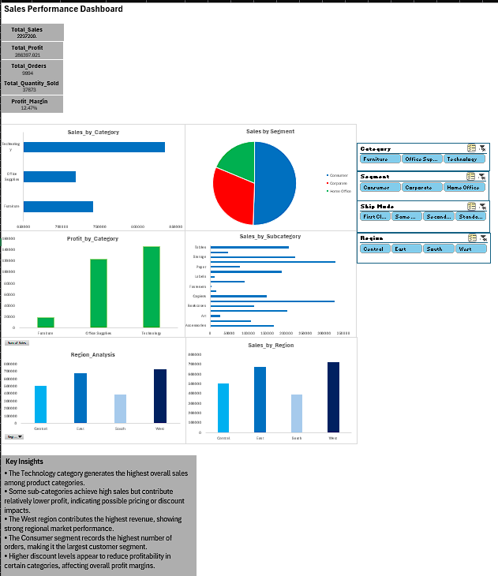

# Sales Data Analysis Dashboard

This project presents an interactive Sales Data Analysis Dashboard built using Microsoft Excel.  
The dashboard helps analyze sales performance, profitability, and customer segments using data visualization and pivot table analysis.

## Dashboard Preview

## Tools Used
- Microsoft Excel
- Pivot Tables
- Pivot Charts
- Slicers
- Data Visualization

## Dashboard Features
• KPI cards displaying Total Sales, Total Profit, and Total Quantity  
• Sales performance by Category  
• Sales distribution by Sub-Category  
• Profit analysis by Category  
• Sales analysis by Customer Segment  
• Interactive slicers for dynamic filtering  

## Key Insights
• Technology category generates the highest sales  
• Some sub-categories show high sales but low profit  
• Western region contributes the highest revenue  
• Consumer segment has the highest number of orders  
• High discounts reduce profitability in some categories  

## Project Purpose
The objective of this project is to demonstrate data analysis and dashboard design skills using Excel for business decision support.
---
Author: Sreerag S
/BCA Data Science Student
